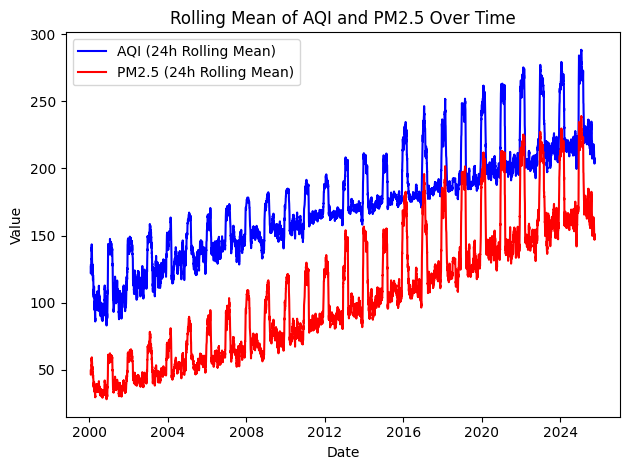
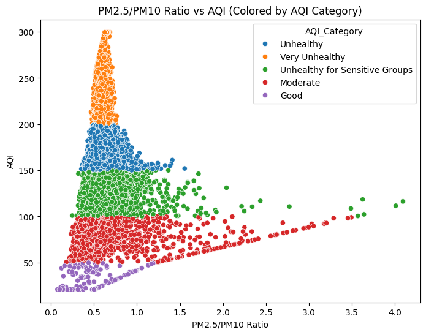
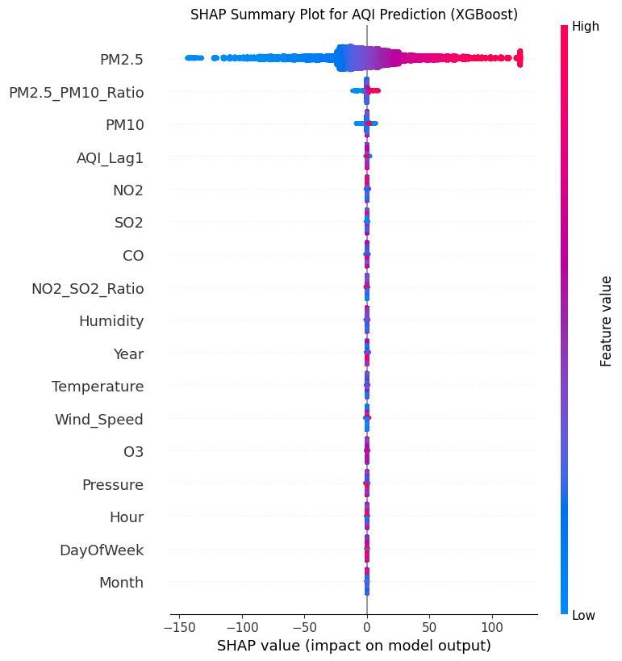
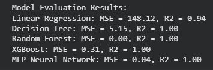

# Dhaka Air Quality Prediction

## Project Overview
This project focuses on predicting Air Quality Index (AQI) levels in Dhaka, Bangladesh, using a synthetic dataset covering the period from 2000 to 2025. Air pollution in Dhaka poses significant health risks, and this analysis aims to leverage historical data to predict future AQI levels and identify key drivers of pollution.

## Objectives
-   **Visualize Trends**: Analyze AQI and pollutant trends over time, and correlate them with meteorological factors.
-   **Feature Engineering**: Create new features such as temporal attributes (year, month, hour, day of week), pollutant ratios, and lagged AQI values.
-   **Model Building**: Develop and evaluate machine learning models (Linear Regression, Decision Tree, Random Forest, XGBoost, MLP Neural Network) for AQI prediction.
-   **Deployment**: Deploy the best-performing model using FastAPI for real-time predictions.

## Dataset
The dataset used is a synthetic dataset for Dhaka Air Quality from 2000-2025, downloaded from KaggleHub:
`shakil10945/dhaka-air-quality-2000-2025-synthetic-dataset`

Key features include:
-   `datetime`: Timestamp of the recording.
-   `AQI`: Air Quality Index (target variable).
-   `PM2.5`, `PM10`, `O3`, `NO2`, `SO2`, `CO`: Concentrations of various pollutants.
-   `Temperature`, `Humidity`, `Wind_Speed`, `Pressure`: Meteorological factors.

## Data Cleaning and Feature Engineering
1.  **Missing Values**: Handled using median imputation.
2.  **Outliers**: Treated using the IQR method.
3.  **Invalid Values**: Clipped pollutant concentrations to be non-negative.
4.  **Temporal Features**: Extracted year, month, day, hour, and day of week from the `datetime` column.
5.  **Pollutant Ratios**: Calculated `PM2.5_to_PM10` and `NO2_to_SO2`.
6.  **Lagged Features**: Created `AQI_lag1`, `AQI_lag3`, `AQI_lag6`.
7.  **AQI Categorization**: Categorized AQI into 'Good', 'Moderate', 'Unhealthy for Sensitive Groups', 'Unhealthy', 'Very Unhealthy', and 'Hazardous'.
8.  **Scaling**: Numerical features were scaled using `StandardScaler`.

## Exploratory Data Analysis (EDA)
Various visualizations were performed to understand the data:
-   **Histograms**: Distribution of numerical features.
-   **Line Plots**: AQI and pollutant trends over time, and correlation with meteorological variables.
-   **Bar Plots**: Mean AQI/pollutant levels by year, month, and hour; count of AQI categories.
-   **Box Plots**: Distribution of AQI/pollutants by temporal factors and AQI categories.
-   **Violin Plots**: Distribution of pollutants by season and time of day.
-   **Correlation Heatmap**: Relationships between numerical features.
-   **Pair Plots**: Relationships between pollutants and meteorological factors, colored by AQI category.

## Model Training
Several regression models were trained to predict AQI:
-   Linear Regression
-   Decision Tree Regressor
-   Random Forest Regressor
-   XGBoost Regressor
-   MLP Neural Network

**Evaluation Metrics**: Mean Squared Error (MSE) and R-squared (R²).

XGBoost and Random Forest demonstrated excellent performance, achieving R² scores very close to 1.00.

## FastAPI Deployment
The trained XGBoost model is deployed using a FastAPI application. The application:
-   Loads the pre-trained `xgb_model` and `scaler`.
-   Defines an `AQIInput` Pydantic model for incoming data.
-   Exposes a `/predict` endpoint that:
    -   Receives raw air quality and meteorological data along with a timestamp.
    -   Performs feature engineering on the fly (extracting temporal features, calculating ratios).
    -   Scales the input data.
    -   Uses the loaded model to predict the AQI.
    -   Returns the predicted AQI.

### How to Run the FastAPI Application (Local Testing)
1.  Ensure you have Python installed.
2.  Install the required libraries:
    ```bash
    !pip install fastapi uvicorn pydantic scikit-learn xgboost pandas
    ```
3.  Save the provided FastAPI code (from the notebook) into a file named `main.py`.
4.  Run the application using Uvicorn:
    ```bash
    !uvicorn main:app --host 0.0.0.0 --port 8000 --reload
    ```
    (Note: `--reload` is useful for development but can be removed for production)
5.  Access the API documentation at `http://0.0.0.0:8000/docs` to test the `/predict` endpoint.

### Example Prediction Request Structure:
```json
{
  "datetime_str": "2026-01-13 11:15:00",
  "PM2_5": 148.0,
  "PM10": 183.0,
  "O3": 13.0,
  "NO2": 30.0,
  "SO2": 4.0,
  "CO": 95.0,
  "Temperature": 21.0,
  "Humidity": 17.0,
  "Wind_Speed": 10.8,
  "Pressure": 1020.0,
  "AQI_Lag1": 150.0
}
```

## Impact
Insights from this project can inform policy for emission controls, urban planning, and public health alerts in Dhaka, contributing to better air quality management.

## Assets
- **Trend plot**: 
- **PM vs AQI**: 
- **Interpretability**: 
- **Results**: 

These are placeholder images; replace the files under the `assets/` folder with your actual figures (keeping the same filenames) to display real plots in this README.